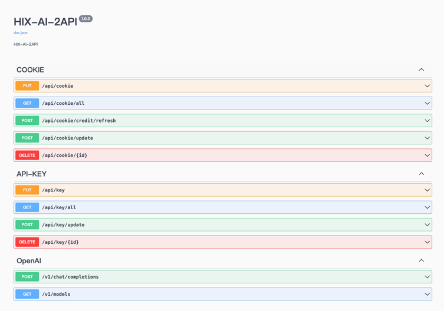

<p align="right">
   <strong>中文</strong> 
</p>
<div align="center">

# HixAI2Api

_觉得有点意思的话 别忘了点个 ⭐_

<a href="https://t.me/+LGKwlC_xa-E5ZDk9">
    
    <span style="text-decoration: none; font-size: 12px; color: #0088cc; vertical-align: middle;">Telegram 交流群</span>
</a>

<sup><i>(原`coze-discord-proxy`交流群, 此项目仍可进此群**交流** / **反馈bug**)</i></sup>
<sup><i>(群内提供公益API、AI机器人)</i></sup>

</div>

## 功能

- [x] 支持对话接口(流式/非流式)(`/chat/completions`),详情查看[支持模型](#支持模型及额度消耗)
- [x] 支持**联网搜索**,在模型名后添加`-search`即可(如:`gpt-4o-search`)
- [ ] 支持识别**图片**/**文件**多轮对话
- [x] 支持自定义请求头校验值(Authorization),详情查看[配置API-KEY](#配置API-KEY)
- [x] 支持cookie池,详情查看[配置COOKIE](#配置COOKIE)
- [x] 支持请求失败自动切换cookie重试(需配置cookie池)
- [x] 支持定时更新Cookie剩余Credit额度
- [x] 可配置代理请求(环境变量`PROXY_URL`)

> ❗︎由于历史对话存储在HixAI的服务上,所以在配置了多`Cookie`下会存在上下文接不上的情况,而且多轮对话下不支持**重新生成回答**、**自定义上下文**、**自定义system/developer角色Content**。

### 接口文档:

`http://<ip>:<port>/swagger/index.html`

<span></span>

### 示例:

<span></span>

## 如何使用

略

## 如何集成NextChat

填 接口地址(ip:端口/域名) 及 [API-KEY](#配置API-KEY),其它的随便填随便选。

> 如果自己没有搭建NextChat面板,这里有个已经搭建好的可以使用 [NeatChat](https://ai.aytsao.cn/)

<span></span>

## 如何集成one-api

填 `BaseURL`(ip:端口/域名) 及 密钥即[API-KEY](#配置API-KEY),其它的随便填随便选。

<span></span>

## 部署

> ❗︎无论哪种部署方式,都需要先部署`MySql`数据库服务,并创建一个数据库,如果你对`Mysql`数据库服务的部署不熟悉,也可以使用[部署到 Zeabur中的Zeabur部署Mysql](#部署到第三方平台)。

#### 创建数据库示例sql命令
```sql
CREATE DATABASE hix_ai_2_api CHARACTER SET utf8mb4 COLLATE utf8mb4_0900_ai_ci;
```

### 基于 Docker-Compose(All In One) 进行部署

```shell
docker-compose pull && docker-compose up -d
```

#### docker-compose.yml

```docker
version: '3.4'

services:
  hixai2api:
    image: deanxv/hixai2api:latest
    container_name: hixai2api
    restart: always
    ports:
      - "7044:7044"
    volumes:
      - ./data:/app/hixai2api/data
    environment:
      - MYSQL_DSN=hix-ai-2-api:123456@tcp(db:3306)/hix_ai_2_api?charset=utf8mb4&parseTime=true&loc=Asia%2FShanghai  # 可修改此行 SQL连接信息
      - BACKEND_SECRET=123456  # [可选]后台管理接口密钥
      - TZ=Asia/Shanghai

  db:
    image: mysql:8.2.0
    restart: always
    container_name: mysql
    volumes:
      - ./data/mysql:/var/lib/mysql  # 挂载目录，持久化存储
    ports:
      - '3306:3306'
    environment:
      TZ: Asia/Shanghai   # 可修改默认时区
      MYSQL_ROOT_PASSWORD: 'root@123456' # 可修改此行 root用户名 密码
      MYSQL_USER: hix-ai-2-api   # 可修改初始化专用用户用户名
      MYSQL_PASSWORD: '123456'    # 可修改初始化专用用户密码
      MYSQL_DATABASE: hix_ai_2_api   # 可修改初始化专用数据库
```

### 基于 Docker 进行部署

```docker
docker run --name hixai2api -d --restart always \
-p 7044:7044 \
-v $(pwd)/data:/app/hixai2api/data \
-e MYSQL_DSN=hix-ai-2-api:123456@tcp(host:3306)/hix_ai_2_api?charset=utf8mb4&parseTime=true&loc=Asia%2FShanghai \
-e BACKEND_SECRET=123456 \
-e TZ=Asia/Shanghai \
deanxv/hixai2api
```

其中`MYSQL_DSN`、`BACKEND_SECRET`修改为自己的。

如果上面的镜像无法拉取,可以尝试使用 GitHub 的 Docker 镜像,将上面的`deanxv/hixai2api`替换为`ghcr.io/deanxv/hixai2api`即可。

### 部署到第三方平台

<details>
<summary><strong>部署到 Zeabur</strong></summary>
<div>

[](https://zeabur.com?referralCode=deanxv&utm_source=deanxv)

> Zeabur 的服务器在国外,自动解决了网络的问题,~~同时免费的额度也足够个人使用~~

1. 首先 **fork** 一份代码。
2. 进入 [Zeabur](https://zeabur.com?referralCode=deanxv),使用github登录,进入控制台。
3. 在 Service -> Add Service,选择 Git（第一次使用需要先授权）,选择你 fork 的仓库。
4. Deploy 会自动开始,先取消。
5. 添加环境变量

   `MYSQL_DSN:hix-ai-2-api:123456@tcp(host:3306)/hix_ai_2_api?charset=utf8mb4&parseTime=true&loc=Asia%2FShanghai`  MYSQL连接信息

   `BACKEND_SECRET:123456` [可选] 后台管理接口密钥

保存。

6. 选择 Redeploy。

</div>

#### Zeabur部署Mysql

<span></span>

按照上图创建MySql服务后,在环境变量`MYSQL_DSN`中填写对应的连接信息。

`Username:Password@tcp(Host:Port)/hix_ai_2_api?charset=utf8mb4&parseTime=true&loc=Asia%2FShanghai`

同样不要忘记[创建数据库](#创建数据库示例sql命令)。

</details>

<details>
<summary><strong>部署到 Render</strong></summary>
<div>

> Render 提供免费额度,绑卡后可以进一步提升额度

Render 可以直接部署 docker 镜像,不需要 fork 仓库：[Render](https://dashboard.render.com)

</div>
</details>

## 配置

### 环境变量

1. `PORT=7044`  [可选]端口,默认为7044
2. `DEBUG=true`  [可选]DEBUG模式,可打印更多信息[true:打开、false:关闭]
3. `BACKEND_SECRET=123456`  [可选]后台管理接口密钥
4. `BACKEND_API_ENABLE=1`  [可选]后台管理接口开关(默认:1)[0:关闭,1:开启]
5. `ROUTE_PREFIX=hf`  [可选]路由前缀,默认为空,添加该变量后的接口示例:`/hf/v1/chat/completions`
6. `PROXY_URL=http://127.0.0.1:7897`  [可选]代理
7. `SWAGGER_ENABLE=1`  [可选]是否启用Swagger接口文档(默认:1)[0:关闭,1:开启]

### cookie获取方式

## 进阶配置

### 配置API-KEY

#### curl示例

```curl
curl -X 'PUT' \
  'http://127.0.0.1:7044/api/key' \
  -H 'accept: application/json' \
  -H 'Authorization: 123456' \
  -H 'Content-Type: application/json' \
  -d '{
  "apiKey": "sk-******"
}'
```

其中`Authorization`为环境变量`BACKEND_SECRET`的值。

### 配置COOKIE

### 获取cookie


1. 打开[HixAi](https://hix.ai/home)
1. 打开**F12**开发者工具
3. 进行一次对话
4. 如下图所示,右侧`chat`请求中请求头`Cookie`中的蓝色高亮`__Secure-next-auth.session-token`的值(红色高亮)即为所需cookie值(整个Cookie的值也可以)
   
<span></span>


#### curl示例

```curl
curl -X 'PUT' \
  'http://127.0.0.1:7044/api/cookie' \
  -H 'accept: application/json' \
  -H 'Authorization: 123456' \
  -H 'Content-Type: application/json' \
  -d '{
  "cookie": "user_group=**************cdi6dYqzEUfi_DJOJcg"
}'
```

其中`Authorization`为环境变量`BACKEND_SECRET`的值。

## 支持模型及额度消耗

| 模型名                  | Credit |
|----------------------|--------|
| deepseek-r1          | 1      |
| deepseek-v3          | 1      |
| chatgpt              | 4      |
| gpt-3.5-turbo        | 4      |
| claude               | 4      |
| claude-3-haiku       | 4      |
| claude-instant-100k  | 8      |
| gpt-3.5-turbo-16k    | 12     |
| claude-3-sonnet      | 20     |
| gpt-4o               | 30     |
| gpt-4-turbo          | 35     |
| claude-2             | 35     |
| claude-2-100k        | 75     |
| claude-3-7-sonnet    | 50     |
| claude-3-5-sonnet-v2 | 100    |
| grok-2               | 100    |
| gpt-4o-128k          | 125    |
| claude-3-opus        | 200    |
| gpt-4-turbo-128k     | 250    |
| claude-2-1-200k      | 300    |
| gpt-4                | 350    |

## 报错排查

> `Forbidden`
>

被各种不可知原因禁止访问,可配置`PROXY_URL`。

(【推荐方案】[自建ipv6代理池绕过cf对ip的速率限制及5s盾](https://linux.do/t/topic/367413)或购买[IProyal](https://iproyal.cn/?r=244330))

## 其他

略


